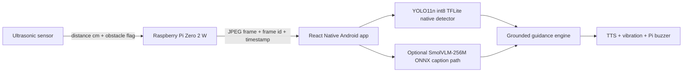

# Maculus Local AI Upgrade Plan

## Goal

Build a fully local vision assistant for blind and low-vision users that stays fast on a low-RAM Android phone while using the Raspberry Pi Zero 2 W only for sensing and streaming.

## Architecture

## Phase 1: Transport And Timing

Done in this upgrade:

- `/capture` still returns JPEG bytes, but now includes:
  - `X-Maculus-Frame-Id`
  - `X-Maculus-Captured-At`
  - `X-Maculus-Resolution`
- React Native now has `fetchFrame()` so frame metadata can travel with image data.

Next improvement:

- Replace repeated HTTP `/capture` polling with a persistent frame stream when the app needs maximum FPS.
- Keep `/distance` polling independent so emergency obstacle warnings never wait for AI inference.

## Phase 2: Native AI Layer

Done in this upgrade:

- Android `MaculusVisionModule` now exposes `analyzeScene(...)`.
- `detect(...)` and `analyzeScene(...)` share the same native detector path.
- `getSceneModelInfo()` reports whether the optional SmolVLM ONNX asset is present.

Next improvement:

- Add ONNX Runtime Mobile after the SmolVLM ONNX input/output contract is fixed.
- Load the VLM lazily only when the user asks for a scene description.

## Phase 3: Guidance Policy

Done in this upgrade:

- Continuous guidance uses detector-grounded analysis only.
- One-shot description asks for captioning, then falls back to deterministic grounded narration.
- Ultrasonic obstacle guidance remains the highest-priority safety path.

Next improvement:

- Add temporal object tracking so speech does not flicker when detections bounce frame to frame.
- Add scene-change detection before running the caption path.

## Phase 4: SmolVLM Caption Path

Recommended implementation order:

1. Put `smolvlm-256m.onnx` and tokenizer/preprocessor files in Android assets.
2. Add ONNX Runtime Mobile dependency.
3. Implement image preprocessing in Kotlin with fixed input sizes.
4. Implement tokenizer and decoder, or bundle a small native/tokenizer helper.
5. Prompt the model with detector context and a strict no-guessing instruction.
6. Cap generation to one short sentence.

## Phase 5: Blind-Assistant Quality

Highest-value model upgrades:

- Fine-tune a tiny detector for: stairs, curb, step, doorway, pole, pothole, crosswalk, railing, wall, glass door.
- Add left/center/right haptic patterns.
- Add confidence smoothing and danger-zone ranking.
- Log missed hazards locally for later model improvement.

## Performance Budget

Target for low-RAM Android:

- Continuous detector loop: as fast as camera/network allows.
- Distance loop: every 500-700 ms.
- Caption model: manual or throttled, never continuous.
- Speech: short messages, cooldowns, emergency interrupt.